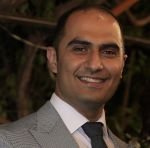

## [About](index.md) | [Publications](publications.md) | [Projects](projects.md) | [Awards](awards.md) | [Contact](contact.md)

I am a [Mitacs Elevate](https://www.mitacs.ca/en/programs/elevate) postdoctoral fellow at the [Institute of Biomedical Engineering](https://bme.utoronto.ca/), [University of Toronto](https://www.utoronto.ca/) and [Holland Bloorview Kids Rehabilitation Hospital](https://hollandbloorview.ca/) working with [Dr. Tom Chau](https://ibbme.utoronto.ca/faculty-research/core-faculty/tom-chau/) focusing on brain signal analysis and tool development for kids with severe movement disabilities. I am also working on empirical algorithmics and algorithm portfolios concepts with [Dr. Antonina Kolokolova](http://www.cs.mun.ca/~kol/).

I received my Ph.D. from the [Department of Computer Science](http://www.mun.ca/computerscience/), [Memorial University of Newfoundland](http://www.mun.ca/), supervised by [Dr. Saeed Samet](http://ssamet.myweb.cs.uwindsor.ca/), [Dr. Wolfgang Banzhaf](http://www.cse.msu.edu/~banzhafw/) and [Dr. Hamid Usefi](http://www.math.mun.ca/~usefi/). I have developed a new noise-robust and scalable feature selection method called perturbation-based feature selection inspired by a historical monument in [Isfahan](https://en.wikipedia.org/wiki/Isfahan) called [Monar Jonban (Shaking Minarets)](https://en.wikipedia.org/wiki/Monar_Jonban), and implemented using perturbation theory and system of equations.

I received my Master degree from the [Department of Computer Engineering](http://ce.uk.ac.ir/en/home), [Shahid Bahonar University of Kerman](http://uk.ac.ir/en/home), supervised by [Dr. Mahdi Eftekhari](https://uk.ac.ir/en/~m.eftekhari) and [Dr. Majid Mohammadi](https://depeng.uk.ac.ir/en/~mohammadi), where I proposed a set of improvements on existing fuzzy-rough set based feature selection methods.

I received my Bachelor degree from the [Department of Computer Engineering](http://en.ashrafi.ac.ir/faculty-and-staff/faculty-of-engineering-and-technology), [Shahid Ashrafi Esfahani University](http://en.ashrafi.ac.ir/), supervised by [Dr. Marjan Kaedi](http://eng.ui.ac.ir/~kaedi), where I have designed and implemented a pipeline to train a self-organizing map neural network to recognize Persian handwritten digits.

## Research interests
- Feature selection
- Classification
